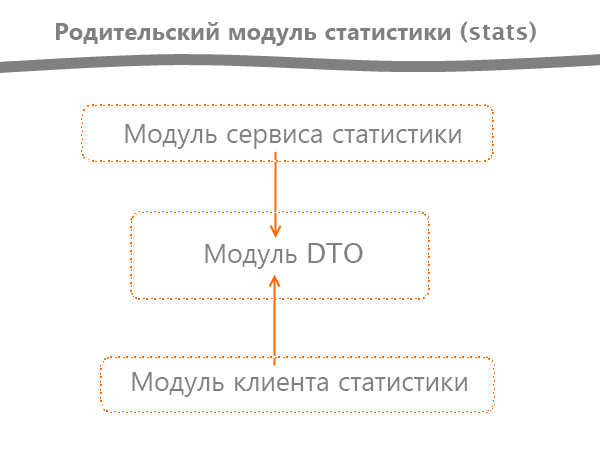

# java-explore-with-me

<!---->

#local test-start
 - in profiles for debug: spring.profiles.active=test, test

ewm-main-service/src/main/resources/application.properties
- comments 4 line  for local test-start
- spring.datasource.driverClassName=org.postgresql.Driver
- spring.datasource.url=${SPRING_DATASOURCE_URL}
- spring.datasource.username=${SPRING_DATASOURCE_USERNAME}
- spring.datasource.password=${SPRING_DATASOURCE_PASSWORD}

ewm-stats-service/client/src/main/resources/application.properties
- comment line for local test-start
- stats-server.url=http://localhost:9090

- comments line for global prod-start
- stats-service.url=${STAT_SERVER_URL}
